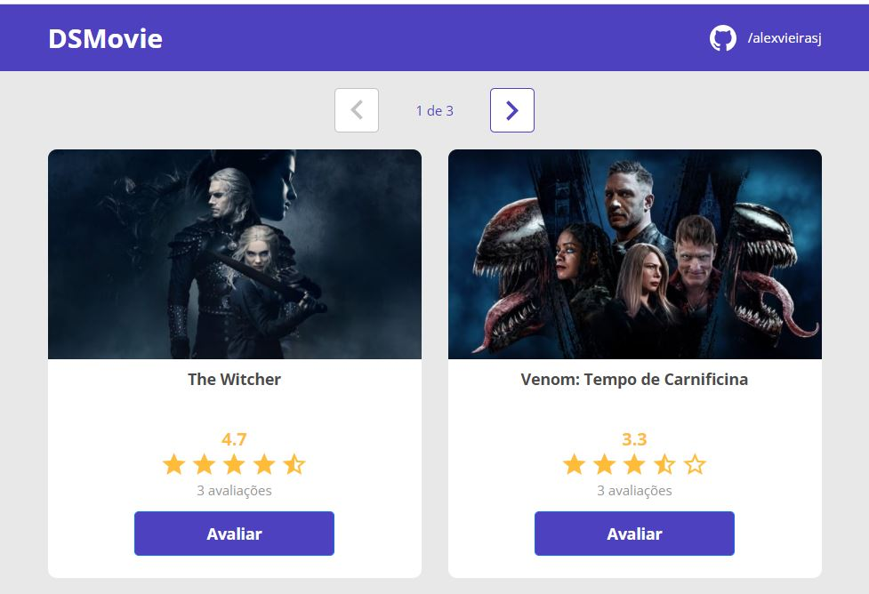

# Site para Avaliação de Filmes

<!---Esses são exemplos. Veja https://shields.io para outras pessoas ou para personalizar este conjunto de escudos. Você pode querer incluir dependências, status do projeto e informações de licença aqui--->




> Aplicativo desenvolvido durante um evento no estilo bootcamp da empresa [DevSuperior](https://www.youtube.com/@DevSuperior/videos). O Sistema faz avaliação dos filmes. Funcionamento: selecione o filme e clique no botão "Avaliar", digite seu melhor email e de uma nota de valores de 1 a 5 estrelas. Para utlizar o aplicativo [Clique Aqui](https://alex-jsv-dsmovie.netlify.app/).

## :rocket: Tecnologias utilizadas no projeto

As tecnologias utilizadas no projeto foram:

- [Spring](https://spring.io/projects)
- [React](https://reactjs.org/docs/getting-started.html)

- Obs: aplicação hospedada nas plataformas Heroku e Netlify

### Ajustes e melhorias

O projeto ainda está em desenvolvimento e as próximas atualizações serão voltadas nas seguintes tarefas listadas abaixo:

- [ ] Reordenar a lista de filmes baseado no número de avaliações
- [ ] Tirar filmes repetidos da lista
- [ ] Fazer um filtro para pesquisar filmes
- [ ] Colocar filtro por categoria
- [ ] Gerar um sql com diversos filmes e inserir no sistema, para atualizar os filmes repetidos

## 💻 Pré-requisitos

Antes de começar, verifique se você atendeu aos seguintes requisitos:
<!---Estes são apenas requisitos de exemplo. Adicionar, duplicar ou remover conforme necessário--->
* Ter instalado algum desses navegadores: `<Firefox / Chrome / Safari>` ou algum outro compativel com `<HTML / ECMAScript 6 ou +>`
* Ter uma máquina `<Windows / Linux / Mac>`.
* Ler a documentação `<README.md>` desse projeto.
* Ter o `<JDK 17>` instalado na maquina e variaveis de ambiente configuradas 
* Instalar o `<PostgreSQL 12>` e o `<pgAdmin 4>`
* Instalar a versão mais recente do `<Heroku CLI>`
* Versão `<LTS 6.14.6 do NPM>`
* Instalar o `<Git>` na máquina

- Obs: playlist com as configurações do ambiente e ferramentas https://www.youtube.com/watch?v=QekeJBShCy4&list=PLNuUvBZGBA8kMTSPMmmNiRm2z0gRxXxox&index=1

## ☕ Usando dsmovie

Para usar o dsmovie, siga estas etapas:

```
    # Clonar o repositório
    $ git clone https://github.com/alexvieirasj/dsmovie.git

    # Entrar no diretório baixado
    $ cd dsmovie
    
    TODO: em construção
```

É preciso ter instalado no computador o [Git](https://git-scm.com) (para rodar os comandos). O projeto pode ser baixado com as linhas de comando citadas ou no formato zip, clicando no botão `<Code>` na opção `<Download ZIP>`

## 📫 Contribuindo para dsmovie
<!---Se o seu README for longo ou se você tiver algum processo ou etapas específicas que deseja que os contribuidores sigam, considere a criação de um arquivo CONTRIBUTING.md separado--->
Para contribuir com <nome_do_projeto>, siga estas etapas:

1. Bifurque este repositório.
2. Crie um branch: `git checkout -b <nome_branch>`.
3. Faça suas alterações e confirme-as: `git commit -m '<mensagem_commit>'`
4. Envie para o branch original: `git push origin <nome_do_projeto> / <local>`
5. Crie a solicitação de pull.

Como alternativa, consulte a documentação do GitHub em [como criar uma solicitação pull](https://help.github.com/en/github/collaborating-with-issues-and-pull-requests/creating-a-pull-request).

## 🤝 Colaboradores

Agradecemos às seguintes pessoas que contribuíram para este projeto:

<table>
  <tr>
    <td align="center">
      <a href="#">
        <br>
        <sub>
          <b>Alex Vieira</b>
        </sub>
      </a>
    </td>
  </tr>
</table>


## 😄 Seja um dos contribuidores<br>

Quer fazer parte desse projeto? Clique [AQUI](CONTRIBUTING.md) (todo: fazer arquivo de contribuição no github) e leia como contribuir.

## 📝 Licença

Esse projeto está sob licença. Veja o arquivo [LICENÇA](https://github.com/alexvieirasj/weather-application/blob/main/LICENSE) para mais detalhes.

[⬆ Voltar ao topo](#weather-application)<br>
